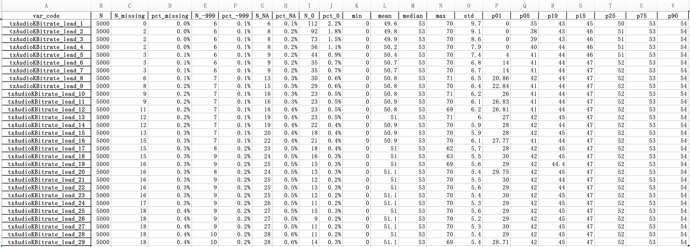
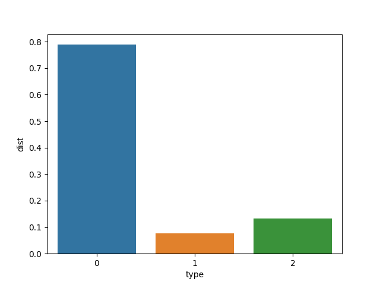
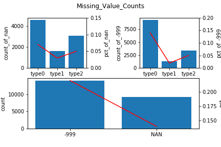
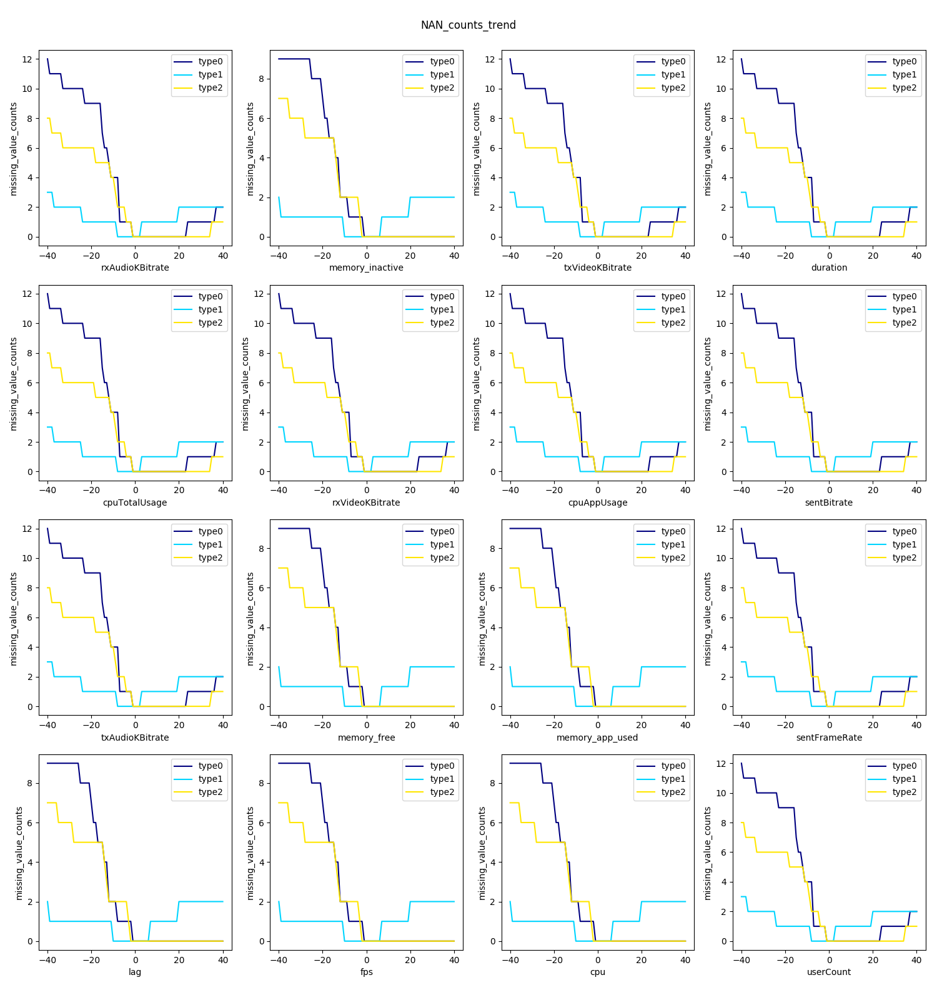
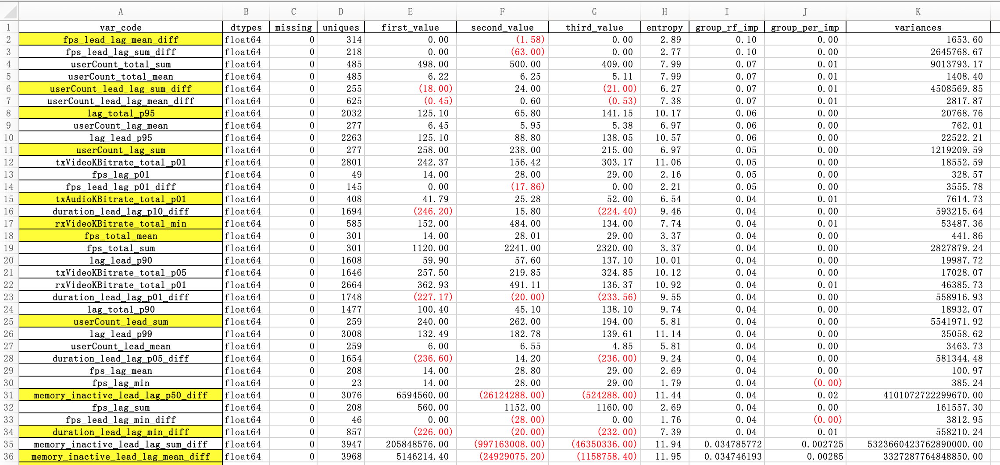
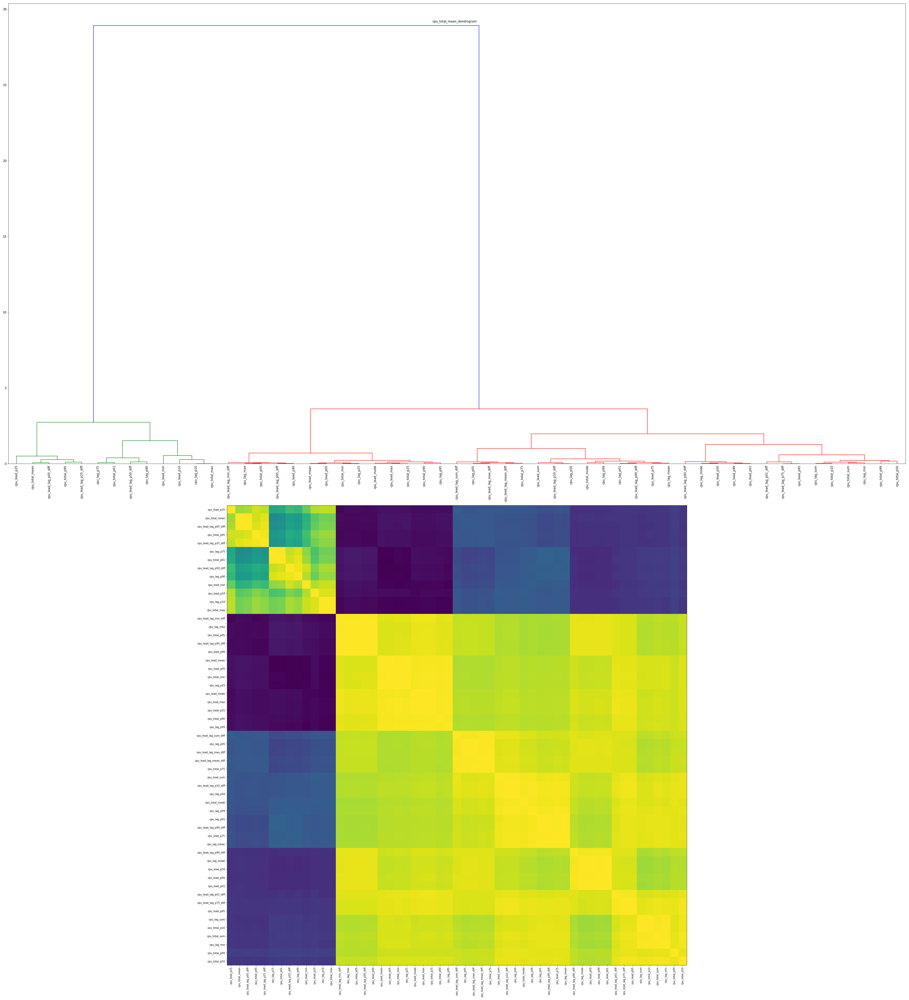
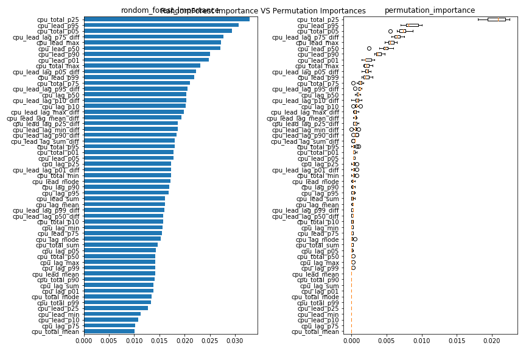
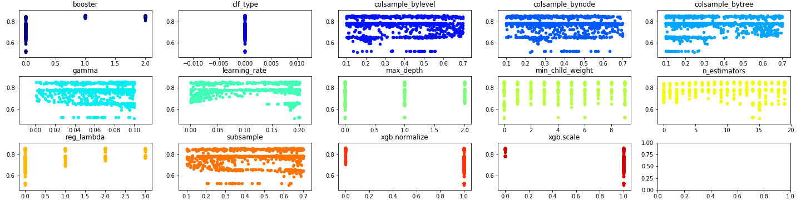
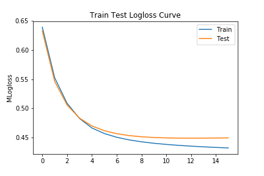
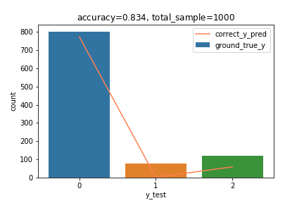

# Mock Project Report

## 文档提供

[谢莹的Github](https://github.com/NoraXie)
联系方式: 18673127322
邮箱: bmdxyn0725@126.com

## 文档说明

路径 | 内容 | 备注
:---: | :---: | :---:
data | 训练集,测试集 | pkl
images | 生成统计图 | png+pdf
scripts | 分析与建模脚本 | py
result_files | 变量字典 | excel

## 数据集信息

1. 5000个样本, 16个特征80次监控记录共1280个变量.
2. 数据基本是float, 除了cpu有负值-1, 另有缺失值-999和nan以外, 数据基本都为连续的正数
3. 有些数据值为-999, 占总数据量**0.21%**
4. 有些数据值有Missing, 占总数据量**0.14%**
5. 目标列type有三个值: 0:视频流畅, 1:网络抖动, 2:视频播放卡顿. 其中**0:1:2 = 79:7.8:13**

###### 特征描述性统计

###### 目标类型分布

###### 业务理解与变量解释

> 业务理解

视频直播时, 往往出现播放不流畅的问题. 导致卡顿的原因是多方面的, **一是**用户本身硬件不能支持网络视频直播,如cpu太旧, 内存太小等等; **二是**网络状况不好, 与视频发送网关链路的连接比较耗时甚至是不通, 如ping不通或者ping server非常耗时; **三是**发送码率低, 发送端视频本身画质音质不高, 接收到的视频画质音质不可能好; **四是**接收码率低, 接收端画质音质严重受损; **五是**桢率低, 导致动画不流畅. 

监控日志中采集的性能指标大多是瞬时值, 所以需要综合多次监控的性能指标总体评估. 

> 特征

---

**码率**: 码率越高, 视频与音频的损失越小, 画质与音质都相对高.
**桢率**: 动画的流畅度, 桢率越高动画越流畅, 但也有上限值, 30fps ~ 60fps合理.
**cpu使用率**: 视频直播因为需要cpu去解压, 因此会占用一些cpu. 
**icmp时延**: 时延不宜过长, 过长说明网络状况不好. 超时直接说明无法ping通.
**内存**: 系统内存使用率过高时, 系统会出现死机的情况.

---
**duration:** 通话时长(s)，重置链接后清零. 个人理解播放不流畅时会反复重连.
**txAudioKBitrate:** 瞬时值, 与监控时间点有关.
**rxAudioKBitrate:** 瞬时值, 与监控时间点有关.
**txVideoKBitrate:** 瞬时值. 码率越高画面损失越小. 
**rxVideoKBitrate:** 瞬时值. 码率越高画面损失越小.
**cpuTotalUsage:** 当前系统的 CPU 使用率 (%), 系统cpu占用过高, 可能存在其他运行中的APP消耗CPU.
**cpuAppUsage:** 当前 App 的 CPU 使用率 (%), 过高, 说明解码时消耗cpu,与硬件本身有关.
**userCount:** 当前频道内的用户人数.
**sentFrameRate:** 不重要
**sentBitrate:** 不重要

----
**cpu:** 上报数列的最高值, 监控采集到的该用户的最大cpu核数.
**lag:** 客户端与game server的ping值, icmp的ping一次的耗时
**fps:** 客户端的针率, 动画流畅度衡量指标.
**memory\_free：**客户端未使用的内存大小, 内存空闲大, 说明系统
**memory\_app_used:**
**memory_inactive:**

## 特征预处理

### 缺失值

缺失产生的原因主要有两种: 一是变量在某些情况下不存在; 一是变量的值没有被记录下来.比如A某在电商平台的消费记录缺失, 可能是这两种原因导致的. 如果A某与电商购物相关的数据指标全部缺失, 这很可能是因为A某是个不在网络上购物的人, 因此电商消费记录缺失是合理的; 而如果A某有过在京东的消费记录, 但没有淘宝的消费行为, 此时淘宝消费数据的缺失很有可能是因为业务数据没有被正确记录导致, 此时需要对缺失值进行适当的处理. 

本项目中视频监控日志数据的缺失是因为没有被记录下来导致的缺失, 因此需要根据指标的特征进行适当的填充. 具体的观察, 数据集由16个特征的80次监控日志构成. 因此可以对16个特征的缺失情况从两个角度展开观察. 一是所属**类别**, 另一个是变量**80次监控观察**.

#### 整体缺失统计分布

总体上, 三个类别-999与NAN的分布基本一致.都是$N(type0)>N(type2)>N(type1)$且$N(-999)>N(NaN)$.

#### 16个特征80次监控数据的NAN统计量

		
16个特征在80次监控中出现NAN的次数分布一致.有三个特征. 

1. 监控日志越早, NAN出现的次数越多. [X\_lead\_40 ~ X\_lead\_20]这个区间的特征从均值, 最大, 最小值来看, 都存在type0>type1>type2的趋势.
2. 越接近工单提交时间点, 监控日志中的NAN越少, 而当出现NAN时属于**type2**的概率较大. 如**cpu\_lead\_5-cup\_lead\_2**. X\_lead\_1和X\_lag\_1均无NAN缺失情况.
3. 工单提交后的监控日志中, NAN数量显著下降, 且出现type1的人占多数. 

> 终上所述, 缺失产生的原因都是因为监控日志未记录, 从这一业务含义出发, 加上缺失的分布一致出发, 因此将NAN也填充为-999.

## 特征衍生

数据集很特殊, 16个特征每一个都有80次监控日志, 因此同一个变量的80次监控是高度相关的. **本次预测的目标降低人工审核的工单提交率, 即尽可能多的识别出可以自动关闭的工单,但是不能错把需要人工支持的工单关闭.** 所以每个变量在使用时, 考虑从80次监控中提取性能最差的进行综合成一个变量后使用. 

###### 衍生逻辑有四个维度

- 每个用户80次监控数据的最大值
- 每个用户80次监控数据平均值
- 每个用户80次监控数据的最小值
- 每个用户80次监控数据的众数
- 每个用户80次监控数据之和
- 每个用户80次监控数据第1分位数
- 每个用户80次监控数据第5分位数
- 每个用户80次监控数据第10分位数
- 每个用户80次监控数据第25分位数
- 每个用户80次监控数据第50分位数
- 每个用户80次监控数据第75分位数
- 每个用户80次监控数据第90分位数
- 每个用户80次监控数据第95分位数
- 每个用户80次监控数据第99分位数

---

- 每个用户前40次监控数据的最小值
- 每个用户前40次监控数据平均值
- 每个用户前40次监控数据的最大值
- 每个用户前40次监控数据之和
- 每个用户前40次监控数据的众数
- 每个用户前40次监控数据的第1分位数
- 每个用户前40次监控数据的第5分位数
- 每个用户前40次监控数据的第10分位数
- 每个用户前40次监控数据的第25分位数
- 每个用户前40次监控数据的第50分位数
- 每个用户前40次监控数据的第75分位数
- 每个用户前40次监控数据的第90分位数
- 每个用户前40次监控数据的第95分位数
- 每个用户前40次监控数据的第99分位数

---

- 每个用户后40次监控数据的最小值
- 每个用户后40次监控数据的平均值
- 每个用户后40次监控数据的最大值
- 每个用户后40次监控数据之和
- 每个用户后40次监控数据的众数
- 每个用户后40次监控数据的第1分位数
- 每个用户后40次监控数据的第5分位数
- 每个用户后40次监控数据的第10分位数
- 每个用户后40次监控数据的第25分位数
- 每个用户后40次监控数据的第50分位数
- 每个用户后40次监控数据的第75分位数
- 每个用户后40次监控数据的第90分位数
- 每个用户后40次监控数据的第95分位数
- 每个用户后40次监控数据的第99分位数

--- 

- 每个用户前40次监控数据最小值 - 后40次监控数据最小值
- 每个用户前40次监控数据平均值 - 后40次监控数据平均值
- 每个用户前40次监控数据最大值 - 后40次监控数据最大值
- 每个用户前40次监控数据之和 - 后40次监控数据之和
- 每个用户前40次监控数据第1分位数 - 后40次监控数据第1分位数
- 每个用户前40次监控数据第5分位数 - 后40次监控数据第5分位数
- 每个用户前40次监控数据第10分位数 - 后40次监控数据第10分位数
- 每个用户前40次监控数据第25分位数 - 后40次监控数据第25分位数
- 每个用户前40次监控数据第50分位数 - 后40次监控数据第50分位数
- 每个用户前40次监控数据第75分位数 - 后40次监控数据第75分位数
- 每个用户前40次监控数据第90分位数 - 后40次监控数据第90分位数
- 每个用户前40次监控数据第95分位数 - 后40次监控数据第95分位数
- 每个用户前40次监控数据第99分位数 - 后40次监控数据第99分位数

###### 变量字典, V2字典文件截图如下

- V1: result\_files/feature\_dict.xlsx, 原生变量summary
- V2: result\_files/feature\_dict\_v2.xlsx, 衍生的新变量及重要性排序 

###### 特征选择

通过变量衍生, 我们新增了770个特征. 这是因为16个基础特征每个特征分别衍生了55个新特征, 而这55个特征之间本身存在很高的相关性. 

考虑针对16个基础特征在训练集上层次聚类, 观察每个特征组的相关性, 根据相关性进行变量筛选.变量相关性的图见**images/x\_correlation.png**, 如下图所示.
另通过RandomForest在训练集上计算了变量重要性, 重要性排序图在路径
**images/x\_importance\_comparison.png**

> cpu corralation

> cpu random forest feature importance

### 训练模型

###### 学习算法XGBoost

xgboost非常灵活, 支持几乎所的基学习器, 因此这里选择xgboost. 调参时通过选择booster选择不同基学习器类型.

##### 入模特征

特征 | 变量名 | 
:---: | :---: | :---:
cpu\_lead\_mode| 前40次监控数据众数
cpu\_total\_p01| 80次监控数据第1分位数
duration\_lead\_lag\_min\_diff| 前后40次监控数据最小值之差
duration\_lead\_lag\_p01\_diff| 前后40次监控数据第1分位数之差duration\_lead\_lag\_p05\_diff| 前后40次监控数据第5分位数之差
duration\_lead\_lag\_p10\_diff| 前后40次监控数据第10分位数之差
duration\_total\_mode| 80次监控数据众数
fps\_lag\_mean| 后40次监控数据平均值
fps\_lag\_min| 后40次监控数据最小值
fps\_lag\_p01| 后40次监控数据最小值
fps\_lag\_sum| 后40次监控数据最小值
fps\_lead\_lag\_mean\_diff| 前后40次监控数据平均值之差
fps\_lead\_lag\_min\_diff| 前后40次监控数据最小值之差
fps\_lead\_lag\_p01\_diff| 前后40次监控数据第1分位数之差
fps\_lead\_lag\_p10\_diff| 前后40次监控数据第10分位数之差
fps\_lead\_lag\_sum\_diff| 前后40次监控数据之和之差
fps\_total\_mean| 80次监控数据平均值
fps\_total\_sum| 80次监控数据之和
lag\_lead\_p90| 前40次监控数据第90分位数
lag\_lead\_p95| 前40次监控数据第95分位数
lag\_lead\_p99| 前40次监控数据第99分位数
lag\_total\_p90| 80次监控数据第90分位数
lag\_total\_p95| 80次监控数据第95分位数
lag\_total\_p99| 80次监控数据第99分位数
memory\_app\_used\_lead\_lag\_min\_diff| 前后40次监控数据最小值之差
memory\_app\_used\_lead\_lag\_p01\_diff| 前后40次监控数据第1分位数之差memory\_app\_used\_lead\_lag\_p05\_diff| 前后40次监控数据第5分位数之差memory\_app\_used\_lead\_lag\_p10\_diff| 前后40次监控数据第10分位数之差memory\_app\_used\_lead\_lag\_p25\_diff| 前后40次监控数据第25分位数之差memory\_free\_total\_max| 80次监控数据最大值
memory\_inactive\_lead\_lag\_max\_diff| 前后40次监控数据最大值之差
memory\_inactive\_lead\_lag\_mean\_diff| 前后40次监控数据均值之差
memory\_inactive\_lead\_lag\_min\_diff| 前后40次监控数据最小值之差
memory\_inactive\_lead\_lag\_p01\_diff| 前后40次监控数据第1分位数之差
memory\_inactive\_lead\_lag\_p05\_diff| 前后40次监控数据第5分位数之差
memory\_inactive\_lead\_lag\_p25\_diff| 前后40次监控数据第25分位数之差
memory\_inactive\_lead\_lag\_p50\_diff| 前后40次监控数据第50分位数之差
memory\_inactive\_lead\_lag\_p75\_diff| 前后40次监控数据第75分位数之差
memory\_inactive\_lead\_lag\_p90\_diff| 前后40次监控数据第90分位数之差
memory\_inactive\_lead\_lag\_p99\_diff| 前后40次监控数据第99分位数之差
memory\_inactive\_lead\_lag\_sum\_diff| 前后40次监控数据和之差
rxVideoKBitrate\_lead\_min| 前40次最小值
rxVideoKBitrate\_total\_min| 80次最小值
rxVideoKBitrate\_total\_p01| 80次第1分位数
txAudioKBitrate\_lead\_lag\_mean\_diff| 前后40次监控数据均值之差
txAudioKBitrate\_lead\_lag\_p01\_diff| 前后40次监控数据第1分位数之差
txAudioKBitrate\_lead\_lag\_p05\_diff| 前后40次监控数据第5分位数之差
txAudioKBitrate\_total\_p01| 80次第1分位数
txAudioKBitrate\_total\_p99| 80次第99分位数
txVideoKBitrate\_lag\_p05| 后40次第5分位数
txVideoKBitrate\_total\_min| 80次最小值
txVideoKBitrate\_total\_p01| 80次第1分位数
txVideoKBitrate\_total\_p05| 80次第5分位数
txVideoKBitrate\_total\_p10| 80次第10分位数
userCount\_lag\_mean| 后40次均值
userCount\_lag\_sum| 后40次之和
userCount\_lead\_lag\_mean\_diff| 前后40次监控数据均值之差
userCount\_lead\_lag\_sum\_diff| 前后40次监控数据和之差
userCount\_lead\_mean| 后40次均值
userCount\_lead\_sum| 后40次之和
userCount\_total\_mean| 80次均值
userCount\_total\_min| 80次最小值
userCount\_total\_sum| 80次之和

###### 模型

> 数据集 

- 训练集: $4000 * 63$
- 测试集: $1000 * 63$

> 参数

- objective: softmax
- mlogloss: 0.51
- booster: gblinear
- max_depth: [4,5,6]

> 模型损失函数

> 准确率

